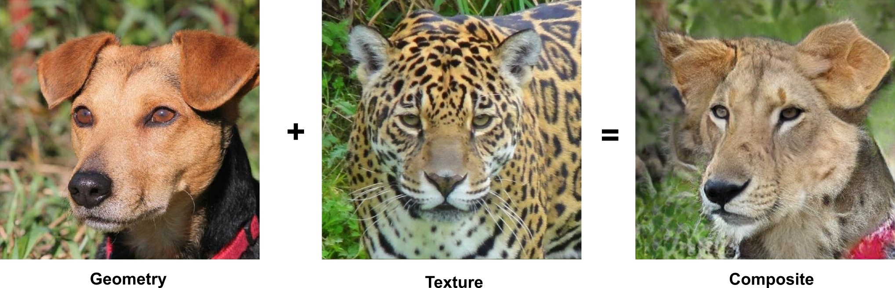

# StarGAN V2 with Modulated Convolutions

Experiments on replacing Adaptive Instance Normalization(AdaIN) layers in [__StarGAN V2__](https://github.com/clovaai/stargan-v2) model.

The presented results was obtained in a 24 hours on a single Colab GPU.

For more information see [Modifying StarGAN V2 using Modulated Convolutions](https://v-hramchenko.medium.com/modifying-stargan-v2-using-modulated-convolutions-13dc5796cd6e).

